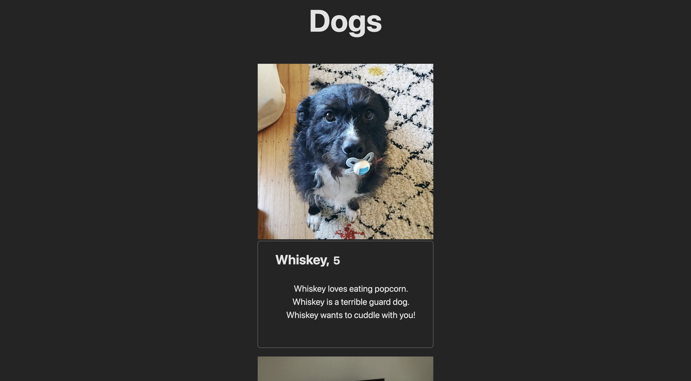
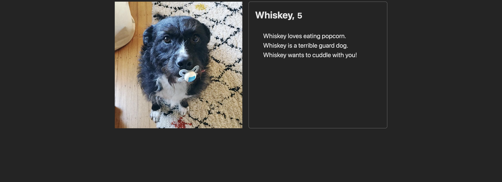
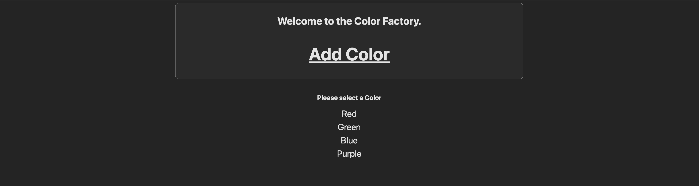

# React Router Patterns

These 3 applications are to get more familiar with React Router Dom routes. This focuses on BrowserRouter, Routes and Route. Using Link, useEffect, useNavigate, useState, useParams. Each app has a default path so anything not valid will default to each 'home' page.

### `Dog Directory`

This is a directy to show dogs. Each dog card displays a photo, name, age and some facts about that dog. Each name is clickable that links to their individual page.

### `Color Factory`

This is a page that saves colors in the localStorage and has seperate pages using that color for all colors. You can add a color by naming it anything and picking the color via the color pick input.

### `Calculator`

-- in progress --

## Available Scripts

### `npm run dev:dog`

Runs the developmenal server for the Dog App.
Can be viewed at http://localhost:5173/ in the browser.

### `npm run dev:colors`

Runs the developmenal server for the Colors App.
Can be viewed at http://localhost:5173/ in the browser.

### `npm run dev:calc`

Runs the developmenal server for the Calculator App.
Can be viewed at http://localhost:5173/ in the browser.

## Screenshots

### Dog Directory

### Color Factory

### Calculator
